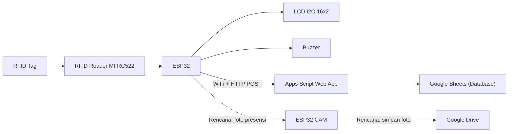

# Sistem Presensi Otomatis Berbasis ESP32 (RFID + LCD + Buzzer) Terintegrasi Google Sheets


> Sistem presensi otomatis yang membaca **UID kartu RFID**, menampilkan status pada **LCD**, memberi feedback lewat **buzzer**, lalu mengirim data presensi ke **Google Sheets** secara *real-time* melalui **Google Apps Script (Web App)**.

---

## 📌 Overview
Sistem presensi konvensional (tanda tangan/kertas) rentan terhadap pemalsuan, kehilangan arsip, dan sulit divalidasi secara objektif. Proyek ini menawarkan solusi presensi digital berbasis **ESP32 + RFID**, terhubung WiFi untuk mengirim data presensi ke *cloud* (Google Sheets).  
Rencana integrasi kamera (ESP32-CAM) disiapkan untuk dokumentasi visual, namun pada implementasi saat ini fitur kamera belum terintegrasi penuh (lihat bagian **Limitasi**).

---

## 🎯 Tujuan Proyek
- Membangun sistem presensi otomatis berbasis ESP32 dengan integrasi RFID (dan rencana kamera).
- Mengidentifikasi pengguna melalui UID RFID yang terdaftar.
- Mengirim data presensi ke database *cloud* (Google Sheets) secara real-time.
- Mengoptimalkan sistem agar hemat daya menggunakan mode *low-power*.

---

## 🧩 Fitur Utama
- **Scan RFID** untuk presensi (UID → nama).
- **LCD I2C 16x2** untuk menampilkan pesan (*Akses Diterima/Akses Ditolak* + nama).
- **Buzzer** sebagai notifikasi audio.
- **Upload data presensi** ke Google Sheets via HTTP POST (Apps Script Web App).
- **Low power**: masuk mode standby jika idle, bangun saat ada scan RFID.

---

## 📊 Alur Kerja Sistem


---

## 🛠️ Spesifikasi Teknis
- **MCU**: ESP32 (WiFi + dual core)
- **Input**: RFID Reader (MFRC522) + RFID Tag
- **Output**: LCD I2C 16x2, Buzzer
- **(Rencana)**: ESP32-CAM untuk dokumentasi visual
- **Database**: Google Sheets
- **Komunikasi**: WiFi + HTTP POST ke Apps Script Web App
- **Baud Serial**: 115200 bps

---

## 🔌 Wiring (Koneksi Hardware)

### LCD I2C → ESP32
- **SDA** → D21  
- **SCL** → D22  
- **VCC** → D27 *(dipakai juga sebagai kontrol power LCD pada mode low power)*  
- **GND** → GND

### Buzzer → ESP32
- **(+)** → D25  
- **(-)** → GND

### RFID MFRC522 → ESP32
- **SCK** → D18  
- **MOSI** → D23  
- **MISO** → D19  
- **SDA/SS** → D4  
- **RST** → D5  
- **VCC** → 3.3V  
- **GND** → GND  

> Catatan: sesuaikan **SS/SDA** dan **RST** dengan definisi pin di kode yang kamu pakai. (Di laporan terdapat contoh definisi `SS_PIN=5` dan `RST_PIN=4`, sedangkan wiring menyebut SDA→D4 dan RST→D5.)

---

## ☁️ Setup Database: Google Sheets + Apps Script

### 1) Buat Google Sheet
Buat spreadsheet dengan kolom minimal:
- `UID`
- `Nama`
- `Waktu Presensi`

### 2) Buat Apps Script (Web App)
Di Google Sheets: **Extensions → Apps Script**, lalu buat endpoint `doPost(e)` untuk menerima `uid` dan `name`, lalu `appendRow`.

Contoh minimal:
```javascript
function doPost(e) {
  var sheet = SpreadsheetApp.getActiveSpreadsheet().getSheetByName("Sheet1");
  var uid = e.parameter.uid;
  var name = e.parameter.name;

  if (uid && name) {
    sheet.appendRow([uid, name, new Date()]);
    return ContentService.createTextOutput("OK");
  } else {
    return ContentService.createTextOutput("Data tidak lengkap!");
  }
}
```

### 3) Deploy sebagai Web App
Deploy sebagai **Web App**:
- Execute as: **Me**
- Who has access: **Anyone (even anonymous)**  
Salin URL Web App → tempel ke kode ESP32 sebagai `serverURL`.

---

## 🧠 Low Power (Standby Mode)
Sistem akan masuk **standby** bila tidak ada aktivitas selama ~10 detik. Saat standby:
- LCD dimatikan lewat pin power (VCC LCD via GPIO).
- WiFi disconnect.
- ESP32 masuk *light sleep* (timer wakeup).
- RFID tetap dibutuhkan untuk membangunkan sistem ketika ada kartu dipindai.

---

## 🚀 Cara Menjalankan

### Prasyarat
- Arduino IDE / PlatformIO
- Board: ESP32 (pastikan sudah install ESP32 core)
- Library:
  - `WiFi.h`
  - `HTTPClient.h`
  - `SPI.h`
  - `MFRC522.h`
  - `Wire.h`
  - `LiquidCrystal_I2C.h`

### Konfigurasi
1. Isi SSID & password WiFi:
   - `const char* ssid = "...";`
   - `const char* password = "...";`
2. Isi URL Apps Script Web App:
   - `String serverURL = "https://script.google.com/macros/s/....../exec";`
3. Daftarkan UID pengguna di array (mapping UID → nama).

### Run
1. Upload program ke ESP32.
2. Buka Serial Monitor (115200).
3. Tap kartu RFID:
   - Jika terdaftar → LCD: **Akses Diterima** + nama, buzzer bunyi, data terkirim ke Google Sheets.
   - Jika tidak terdaftar → LCD: **Akses Ditolak**, buzzer bunyi peringatan.

---

## 📈 Output (Contoh)
**LCD**
- `Scan Kartu RFID`
- `Akses Diterima` + `NAMA`
- `Akses Ditolak!`

**Google Sheets**
- Baris baru otomatis: `UID | Nama | Timestamp`

---

## 🔍 Troubleshooting
| Masalah | Kemungkinan Penyebab | Solusi |
|---|---|---|
| WiFi tidak connect | SSID/password salah / sinyal lemah | Cek SSID/password, dekatkan AP |
| Data tidak masuk ke Sheets | URL Web App salah / belum deploy | Redeploy Apps Script, pastikan akses “Anyone” |
| UID selalu tidak ditemukan | UID belum terdaftar / format UID beda | Print UID dari Serial, samakan format (uppercase) |
| LCD tidak tampil | Alamat I2C salah / wiring SDA-SCL terbalik | Cek alamat (umum 0x27), cek wiring |
| Sleep tidak bekerja | `idleTimeout` belum sesuai / logika standby | Pastikan timer & flag standby berjalan |

---

## ⚠️ Limitasi Saat Ini
- Integrasi **ESP32-CAM** sebagai dokumentasi visual belum berjalan baik (kendala kompatibilitas/komunikasi antara ESP32 dan ESP32-CAM).  
  Fitur utama presensi + upload ke Google Sheets sudah berjalan, sedangkan kamera menjadi fokus pengembangan berikutnya.

---

## 📝 Catatan Penting
- Gunakan **power supply stabil** (ESP32 + RFID + LCD cukup sensitif pada drop tegangan).
- RFID MFRC522 umumnya bekerja pada **3.3V** (hindari 5V langsung).
- Jika digunakan untuk skala besar, disarankan menambah:
  - autentikasi endpoint,
  - penyimpanan terstruktur (DB) selain Sheets,
  - notifikasi admin (email/telegram) saat presensi.

---


